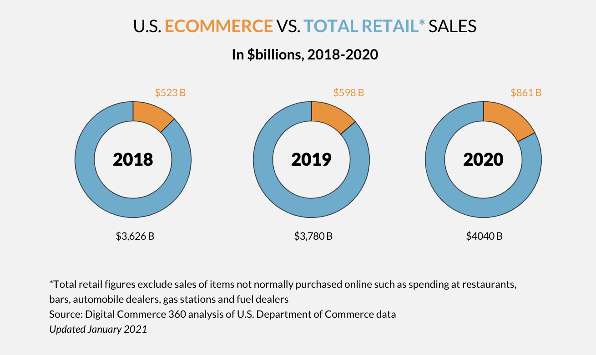
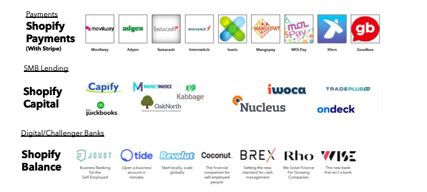
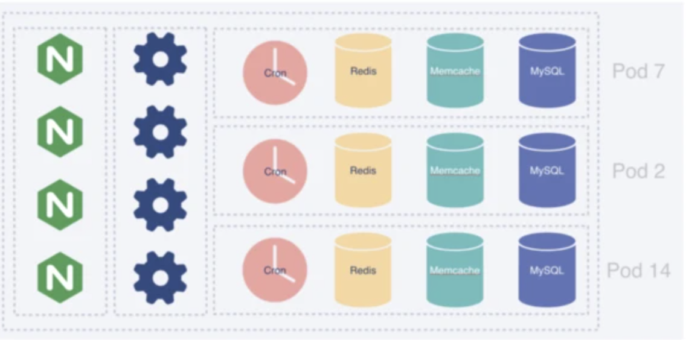
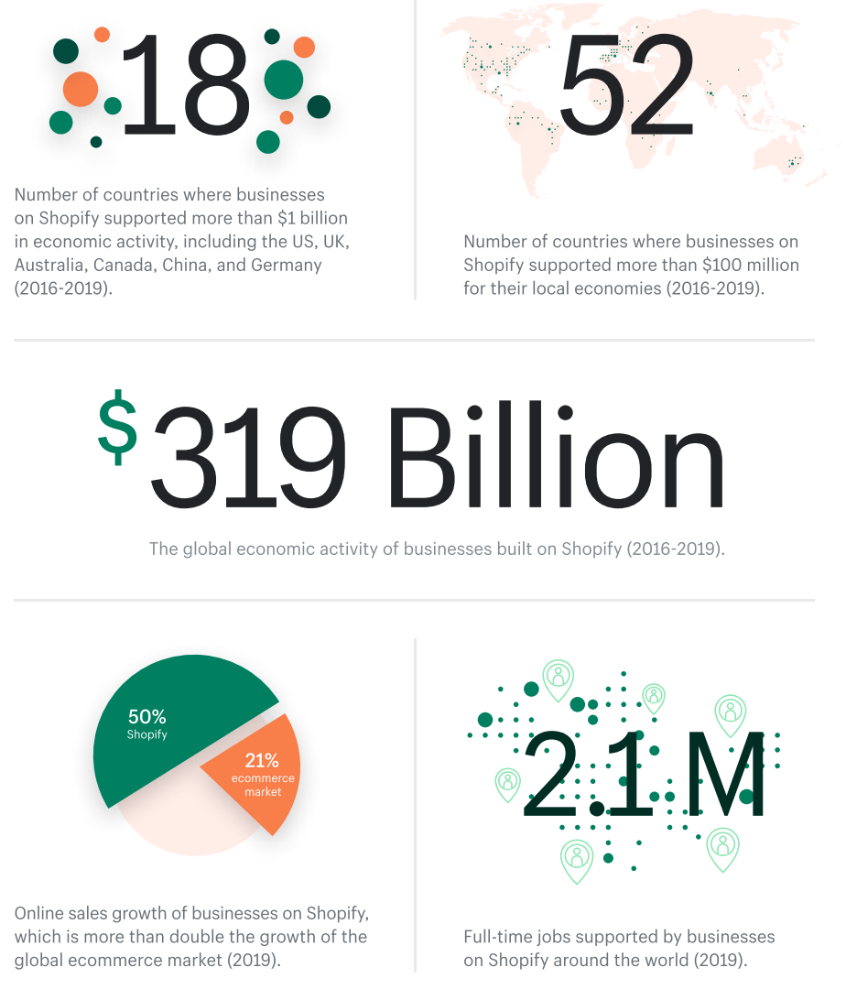
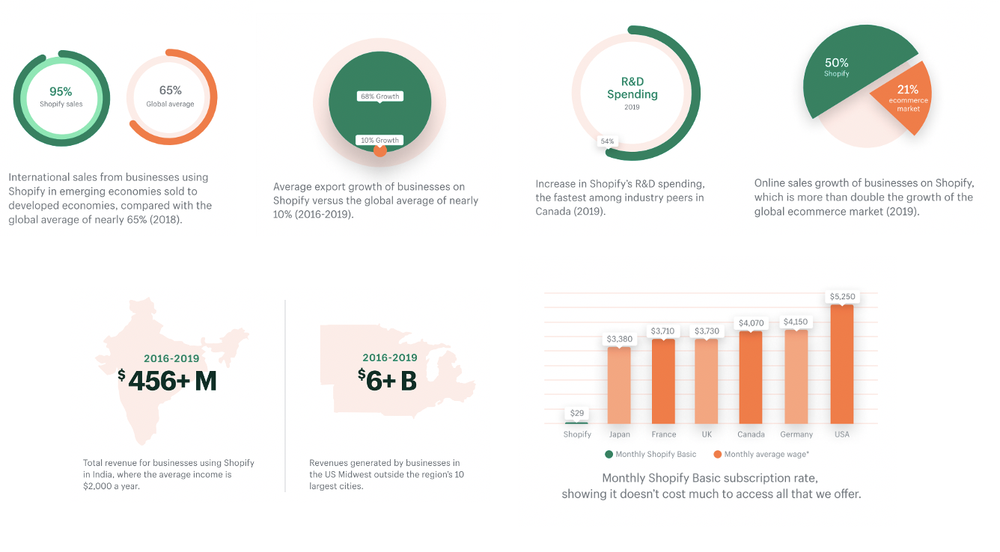
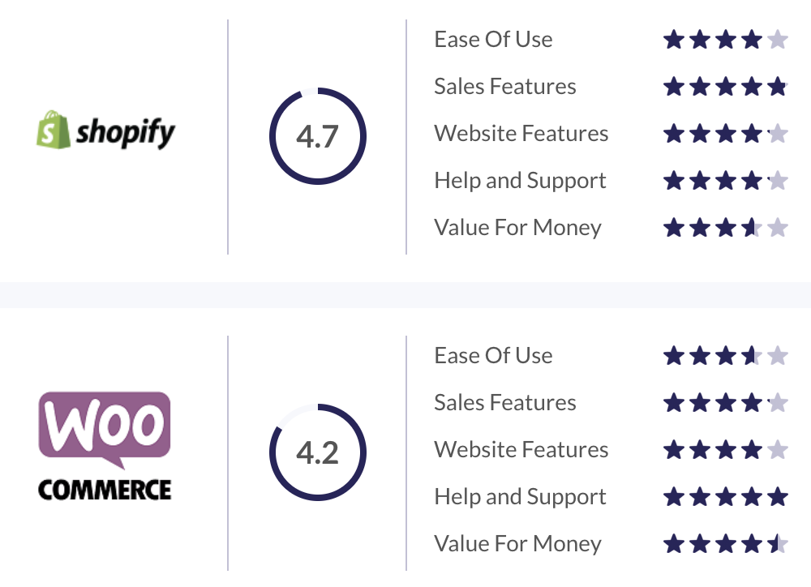
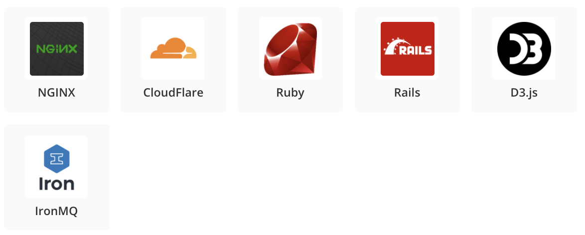

# Unit-1-Homework-Assignment
# Shopify Inc.

## Overview and Origin

* **Name of company**

Shopify Inc.

* **When was the company incorporated?**

Founded in 2004 as Snowdevil's online store and incorpoated as Shopify in June 2006.

* **Who are the founders of the company?**

Tobias Lutke - co-founder and current CEO
Scott Lake -  co-founder
Daniel Weinand - joined later as a co-founder and Chief Design Officer

* **How did the idea for the company (or project) come about?**

Tobias Lutke took a snowboarding trip in his ealry 20s to a ski resort outside of Vancouver, falling in love with the sport. He moved there one year later to pursue the sport and be with his then girlfriend, now wife. Through his girlfried, he met Scott Lake. Tobias and Scott attempted to open an online store for snowboarding equipment in 2004 called Snowdevil. Frustrated by existing e-commerce products available to build the online store, Tobias, a computer programmer, decided to build his own e-commerce platform. Using open source web application framework, Ruby on Rails, Tobias built Snowdevil's online store after two months of development. Recognising that many others would be facing the problems he faced in finding a suitable e-commerce platform, him and Scott launched Shopify in 2006 to address these problems.

* **How is the company funded? How much funding have they received?**

Before approaching venture capitalists, Tobias turned to local Toronto based angel investor, John Phillips for intital capital raisings. In 2007, John invested $250k with Shopify having a valuation of $3 million then. In 2009, John invested a further $500k and joined the board of directors. Since launching their shopping cart function in 2007, Shopify had a net combined total of $100 million in sales by 2009. In 2010, they raised their first series A round of funding for $7 million and one year later in 2011, they raised a series B round of $15 million.

By 2012, Shopify was processing $740 million worth of sales with 40,000 stores using the e-commerce platform across 90 countries, taking a 2.9% +$0.30 transaction fee and charging three tiers of monthy subscriptions.

In 2013, Shopify conducted a series C round of fundraising of $100 million. This enabled Shopify to scale to process 100,000 stores and employ 500 people.

In 2015, Shopify went public with a valuation of $1.3 billion and raised $131 million. Tobias, who held 6.7% of the company in 2015 became a billionare.

In the most recent quarterly report (Q3, 2020), Shopify reported revenue of $977 million with a share price that has surged 4,600% since its IPO in 2015. Shares were then priced at $17 USD in May 2015 and are currently trading for $848 USD.

## Business Activities:

* **What specific financial problem is the company or project trying to solve?**

Shopify's earliest beginnings was as an online store itself, called Snowdevil to sell snowboards online in 2004. In 2006, Shopify began to transform into being an e-commerce platform. Founder Tobias Lutke was frustrated with existing e-commerce platforms and wanted to build something easy to use. Today, Shopify positions itself as - 
>"empowering anyone, anywhere to start a business."

The problem Shopify solves is from the start of a business journey with 1,000s of articles and how to guides on the Shopify blog to providing the the ability to sell, market and manage online.

The specific financial problem Shopify solves is providing a one stop shop to create and customise an online store, accept payments over web, mobile, social media, brick and mortar shops and manage products, inventory and shipping all on the one e-commerce platform. Importantly, Shopify also offers its store users access to data analytics on who their customers are.

Previously, e-commerce stores had to use a variety of products from wordpress for a website, stripe for payments, sendle for shipping, google analytics for marketing analysis and so forth. The problem Shopify solves is bringing this all into one e-commerce platform that streamlines and makes the process more accessible.

* **Who is the company's intended customer?  Is there any information about the market size of this set of customers?**

Shopify's intended customer is anyone, anywhere wanting to start a business. Specifically, Shopify's target market is a person/company wanting to sell online via an e-commerce platform and wants to manage the process from start to finish in one place.

In the US alone, the e-commerce market has grown 44% in last year, during a global pandemic, with consumers spending $861 billion with US merchants. Noting that Amazon still has the lion share of this spending.

There are now an estimated 12-24 million ecommerce sites worldwide and it is estimated that by 2040, 95% of all purchases will be done online, with the ecommerce industry growing by 23% each year. Importantly, it is estimated that in 2020, ecommerce stores lost $756 million in sales due to poor ecommerce processes - this is the market Shopify targets by empowering stores to create easy online experiences for their customers.

* **What solution does this company offer that their competitors do not or cannot offer? (What is the unfair advantage they utilize?)**

There are an estimated 370 ecommerce platforms with well known names such as the ecommerce giants Amazon and Alibaba to widely used ecommerce companies such as Wix, Squarespace and GoDaddy in Australia. 
* What sets shopify apart is the following:
  	* Value for money: Shopify is the cheapest value for money with their lowest subscription of Shopify Lite at $9USD/month offering the Shopify Pay function that can be integrated with a free Facebook Shop.
  	* No coding: Shopify enables online store creation, payment receival and management of inventory and customer marketing with no coding required. For those who want to specialise features, coding is available.
  	* Third Party apps: Shopify empowers developers to write add-ins and apps to personalise a user's store.
  	* Shopify blog: Shopify spends a lot of money on building a community of users sharing problems and solutions on its blog community, enagling the solution to user problems to be quickly found and applied.
  	* Shopify offers 70 payment gateways in more than 50 languages, much more options than its competitors by effectively partnering with payment companies in a range of countries.
  	* Unlimited bandwidth and storage enabling efficient loading speeds on web and mobile.
  	* Partnerships - in 2017, Shopify offered an intergration with Amazon that would allow Shopify stores to sell on Amazon from their stores. Shopify then acquired Oberlo, one of its third party apps, to enable Shopify stores to drop ship to consumers. In 2019, Shopify partnered with Snapchat to offer Shopify stores the ability to sell via Snapchat to Snapchat's 347 million active monthly users.

* **Which technologies are they currently using, and how are they implementing them? (This may take a little bit of sleuthing–– you may want to search the company’s engineering blog or use sites like Stackshare to find this information.)**

Since first being built on Ruby on Rails, Shopify now uses dozens of technologies to operate. This are displayed from Stackshare below:

Specifically focusing on Shopify's fintech offering to small and medium businesses, which series A, B and C funders pointed to as the source of future revenue, Shopify's fintech stack is as follows:

Surmising the stack, Shopify is using the following technologies to offer the following embedded financial abilities for Shopify store users:

1. **Shopify Pay** - a checkout button for online stores, applicable on Shopify online store front and on social media, built in partnership with Stripe and then agreements with 100 alternate third party gateways such as PayPal.
2. **Shop Pay Installments** - buy now, pay later features offered to customers on Shopify online stores, enabled by 
3. **Shopify Balance** — enables Shopify store users to access the money paid by customers instantly, enabled by partnerships with digital neo-banks.
4. **Shopify Capital** - recently Shopify has moved into lending, offering Shopify store users access to loans, using their financial data on the stores to inform lending, through technologies such as capify and quickbooks.

Shopify still uses the original code Tobias built on Ruby on Rails, although this is alongside 100s of apps today. Shopify used MySQL as a relational database since its creation, however in 2014, MySQL wasn't able to store all of Shopify's data. That's when the platform began sharding its data into dozens of smaller databases. Shopify started using Memcached for memory-caching and Redis for key-value storage and ques, along with several other databases. In the last few years, Shopify has transitioned away from shards to pods, enabling separate functionality per a region and preventing global outages.
	
Pods

The tech stack of Shopify Admin began with HTML templates, Prototype JavaScript Framework, and jQuery. Next, it transitioned to Batman JavaScript and then bounced back to basic HTML and Prototype JavaScript. Recently, Shopify Admin landed on React and TypeScript. 

## Landscape:

* **What domain of the financial industry is the company in?**

Shopify spans across four domains:

1. Payments/Billing;
2. Enterprise Solutions;
3. Lending; and
4. RegTech.

The domain I will be focusing on, and where I believe Shopify mainly sits, is in Enterprise Solutions. My understanding of Enterprise Solutions are solutions that integrate multiple facets of a company's business. In Shopify's case, this would be its billing system, inventory management system, customer relationship management system, supplier relationship management system and sale analysis system that it provides to its users.

* **What have been the major trends and innovations of this domain over the last 5-10 years?**

There are 10 major trends and innovations in the Enterprise Solutions domain and their associated benefits are outlined below:

1. Know Enterprise Employees with Machine Learning
	* Previously, machine learning has been used to outwardly analyse customer trends and purchasing habits. Now those same techniques are being used internally to enable companies to understand their employees better - by tracking employee tasks, providing employee's information on how they performed tasks previously, their schedules and interestingly how this will inform the COVID-19 work from home environment we all now work in.
2. Cloud-based Enterprise Software
	* Cloud based computing is arguably the norm across a variety of industries with data being stored and retrieved and accessed in the cloud. This provides great access and efficiency gains for business.
3. Smart Enterprise Applications
	* This is the integration of atificial intelligence into existing enterprise applications such as billing systems, CRM systems and so forth. This enables quicker and more focused searches and access to information.
4. Internet of Things driven Enterprise Solutions
	* This trend really took off through the Fitbit and smart watches for customers globally however, a rangle of physical terminals are used by businesses to collect data and display data that their software systems process.
5. Blockchain keeps Enterprise Data Secure
	* The most notable example of blockchain has been its application to currency to form crypo currency. However, blockchain application is used across businesses to now store their important information.
6. Augmented and Virtual Reality Enterprise Applications
	* Particularly relevant in a COVID-19 world, these technologies have enabled people to engage in a whole new way. In businesses, this has largely been used to run training simulations.
7. Microservices for Enterprises
	* Microservices are blocks of code performing individual tasks that are easier to maintain. In Shopify this has been the addition of third part apps that plug-in for Shopify users to access. This enables access to a huge variety of plug-ins to assist employees in  performing their tasks as needed.
8. Voice-driven Enterprise Software
	* Advancement in speech recognition has seen enterprise software products providing voice driven interfaces to enable quick and efficient enagagement.
9. Improved Enterprise Extensibility with PaaS
	* Platform as a Service (PaaS) is a group of application development tools being used to extend all the applications to the cloud.
10. Instant Notifications for Enterprise Communications
	* Push technology in Enterprise Software Applications allows employees to be informed about news, urgent tasks, updates and issues instantly.

* **What are the other major companies in this domain?**

In the Enterprise Solutions domain, there are giants in respective systems, for example -

* In payment/billing systems we think of Paypal, Stripe, Afterpay; and
* In CRM systems we think of Salesforce, Oracle; and
* In inventory systems we think of Atlassian; Oracle.

But, when we focus in on Enterprise Solutions, the major companies in this space are those that provide all these systems in one place, like Shopify, this would then include the following major companies:

* WooCommerce
* Squarespace
* Amazing Marketplace
* eBay
* BigCommerce
* Wix
* eBay

## Results

* **What has been the business impact of this company so far?**

Every year, Shopify releases its Economic Impact report. According to the most recent report in 2019:
>"The global economic activity of businesses build on Shopify is **$319 Billion**"
									 -Commerce, A force for Good (2019)

Shopify positions itselt as **_democratising capitalism_** by removing barriers to entrepreneurship through its e-commerce tools. The following image sums up Shopify's business impact:

Interestingly, at the Shopify Plus conference, which Shopify hosts annually for its Store users to attend, the CFO announced that Shopify is positioning itself as enabling payments to happen anywhere, across any medium from physical terminals to wireless.

* **What are some of the core metrics that companies in this domain use to measure success? How is your company performing, based on these metrics?**

The Enterprise Solutions domain measures success, at a high level overview, with the following metrics:
	
1. Number of Store users and correspondingly:
	* Number of customers per store;
	* Conversion rates per store;
	* Repeat customers per store;
	* Payments processed via Shopify Pay;
	* Level of membership most used;
	* Which countries store owners reside in.
2. Online sales growth of businesses on the e-commerce platform;
3. Full time jobs supported by businesses on the e-commerce platform;
4. International sales/export growth of businesses on the e-commerce platform;
5. Uptake of e-commerce platform's pay system;
6. Market capitalisation across different stock exhanges;
7. Money invested in R&D.

Shopify is performing well based on these metrics, with the following inforgraphic illustraing its performance:

* **How is your company performing relative to competitors in the same domain?**

Amazon Marketplace dominates the market with sheer size, attracking 150 million customers a month and 9.7 million sellers listed. Whereas, Shopify has 1 million stores. However, its important to remember that Amazon operates as a marketplace whereas Shopify prides itself as a specialised e-commerce platform. It's more realistic to compare Shopify to WooCommerce than marketplace giants like Amazon, eBay and Alibaba for wholesalers.

Comparing Shopify to WooCommerce, its main competitor, the main distinction between the two is that WooCommerce prides itself on being the open source platform for Wordpress whereas Shopify ties you into the Shopify Platform with limited themes etc, however Shopify does extend past the online space with the introduction of payment terminals in brick and mortar stores and into the lending space with Shopify loans. Shopify is multi-dimensional. Comparing the high-level KPIs, from a user experinece, Shopify comes out on top, as illustrated below:

It is worth noting that there are 75 million wordpress sites of which 3.8 million use the WooCommerce plugin. That is close to 4 times the amount of Shopify stores. However, the experience Shopify offers is much more diverse.

## Recommendations

* **If you were to advise the company, what products or services would you suggest they offer? (This could be something that a competitor offers, or use your imagination!)**

I would advice Shopify to implement two abilities:
1. Shopify Pay to handle cryptocurrency as a form of payment; and
2. Shopify Stores to optimise upload speeds and display of 3D models.

* **Why do you think that offering this product or service would benefit the company?**

_Cryptocurrency_
I think the ability to pay for products/services on Shopify stores using Crypto would be a brand piece as well as a technical ability piece. Crypto itselt is contentious but its popularity in recent times can not be disputed, especially with Elon Musk's personal buy into Bitcoin and Tesla's buy in. Furthermore, you can now purchase Tesla with Bitcoin. I think Shopify, which positions itself as the leader in empowering enterprise for anyone, anywhere, should have this ability to pay via crypto as well. It would also enable their payments technology to handle such payments, building architecture that may be the norm in the future.

_3D Models_
The progress in VR and AR technology means the way customers interact with product photos in online shopping may change drastically. Instead, I might don a pair of VR glasses and imagine what it would be like to pick up that handbag and how it would look on me on the Shopify Store. I believe 3D models is the online shopping future. However, 3D model files are much larger than 2D photos even on high quality, Shopify needs to introduce software that optimising the loading speeds of 3D models and its exciting to see they are beginning to do so on their Shopify Help centre.

* **What technologies would this additional product or service utilize?**

_Cryptocurrency_
To enable Shopify Pay to handles Cryptocurrency payments, Shopify would first need to set up a Bitcoin or relevant Cryptocurrency wallet. They would share this wallet via alphanumeric code or a QR code for a customer to enter into their crypto wallet. The amount of crypto to enter will have to valid for a specific time window too since the value of crypto changes unlike fiat money. Shopify may charge a wallet provider fee and Bitcoin charges a network fee. This is one of Crypto's main selling features, you don't need a third party service like Coinbase or Bitpay integrated into your e-commerce platform, you just need to generate a Bitcoin address for each sale.

The technology utlisted here is blockchain. The general application and data needed to create your own wallets and receive/send payments is illustrated in the diagram below:

_3D Models_
Commonly used 3D software to create models include:
	* Maya;
	* Blender; and
	* Photoshop.

Shopify now provides it's own 3D Warehouse App which uses a USDZ format, whereas most models are a GLB format. Shopify can accept both. The main technology advancement needed here is quick uploading and downloading speeds of 3D models. To address this, Shopify will physically need more storage space, computing power and GUIs. Shopify may look at acquiring technologies such as _Pixyz_ to optimise 3D model size.

* **Why are these technologies appropriate for your solution?**

_Cryptocurrency_
Cryptocurrency is enabled by blockchain technology hence is crucial to creating a cryptocurrency wallet and assigning value to crypto as a currency.

_3D Models_
Existing modelling software enables 3D creation and the focus will really be on hardware and optimisation technology to enable handling of much larger files on e-commerce stores.

## Addendum

* https://www.shopify.com.au/
* https://www.shopify.com.au/blog
* https://news.shopify.com/category/press-releases
* https://www.mckinsey.com/industries/financial-services/our-insights/banking-matters/scanning-the-fintech-landscape
* https://www.websitebuilderexpert.com/ecommerce-website-builders/comparisons/shopify-alternatives-competitors/
* https://en.wikipedia.org/wiki/Tobias_L%C3%BCtke
* https://www.npr.org/2019/08/02/747660923/shopify-tobias-l-tke
* https://www.youtube.com/watch?v=Th7XN__ltyc&ab_channel=ShopifyDevs
* https://www.youtube.com/watch?v=N8NWDHgWA28&ab_channel=GOTOConferences
* https://en.wikipedia.org/wiki/Shopify
* https://www.forbes.com/sites/laurendebter/2020/02/25/shopifys-soaring-stock-creates-new-billionaires/?sh=5791ff994ff8
* https://www.entrepreneur.com/article/277329
* https://www.borndigital.com/2015/09/04/a-brief-history-of-shopify-2015-09-04
* https://www.shopify.com/faq
* https://www.digitalcommerce360.com/article/us-ecommerce-sales/
* https://wpforms.com/ecommerce-statistics/
* https://theappideas.com/what-are-the-unique-features-of-shopify/#:~:text=Shopify%20allows%20unlimited%20products%2C%20there,and%20take%20payments%20in%20person.
* https://stackshare.io/shopify/shopify
* https://www.guidance.com/blog/shopify-tech-stack
* https://www.crunchbase.com/organization/shopify/technology
* https://shopify.engineering/a-pods-architecture-to-allow-shopify-to-scale
* https://www.gartner.com/en/information-technology/glossary/enterprise-solutions
* https://blog.techliance.com/enterprise-software-development-trends/
* https://www.shopify.com.au/about/economic-impact
* https://news.shopify.com/now-powering-over-1-million-merchants-shopify-debuts-global-economic-impact-report-271485#:~:text=Businesses%20using%20Shopify%20delivered%20more,of%20the%20global%20ecommerce%20market.
* https://www.shopify.com.au/plus/partners/impact
* https://cdn.shopify.com/static/impact-report/shopify-global-economic-impact-report-summary.pdf?shpxid=b350bc9f-14F5-4837-B6BA-6A97040463DA
* https://www.websitebuilderexpert.com/ecommerce-website-builders/comparisons/shopify-vs-amazon/
* https://au.oberlo.com/blog/amazon-statistics#:~:text=9.-,Number%20of%20Sellers%20on%20Amazon,million%20new%20sellers%20join%20Amazon.
* https://www.wpbeginner.com/opinion/shopify-vs-woocommerce-which-is-the-better-platform-comparison/
* https://online.stanford.edu/future-for-cryptocurrency
* https://help.shopify.com/en/partners/resources/creating-media/3d-models/creating-3d-models
* https://www.tesla.com/support/bitcoin?redirect=no
* https://www.a2hosting.com/blog/accept-bitcoin-payments/

